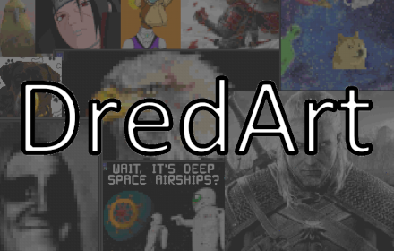

# DredArt - your painting comrade
Chrome and Firefox extension and web tool for [dredark.io / drednot.io / Deep Space Airships](https://drednot.io/)

Allows the user to create pixel art quickly and painlessly - from converting a regular image to pixel art, to painting it flawlessly in-game, saving up to several hours if painting it without the holographic stencils that DredArt has to offer

  
Created from the idea of **MOSAIC** project

## Download from Chrome Web Store
https://chrome.google.com/webstore/detail/ocgomfneelmigjgpgnapekmedbmimamm

## Instalation as local file
1. Click Code button
2. Download ZIP
3. Extract zip
4. Head to chrome://extensions/
5. Enable Developer Mode
6. Click Load unpacked button
7. Select and upload the extracted folder
8. Disable Developer Mode

## Usage
After installing the extension, the control panel will appear in the upper right corner of the game. Clicking on the blue palette launches it. Further instructions are available in the Guide.

### DredArt Designer / Render*
Part of the tool is available [here](https://kapixar.github.io/DredArt/)
It can generates pixel arts from images.

* At the moment Designer is available only at previous 1.4 version

## License
This is open source project under MIT License

### Discord server with more details and fun people!
https://discord.gg/uNgD6vv67c
